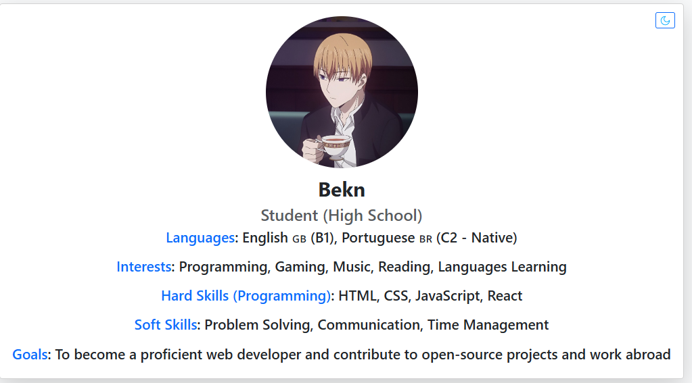
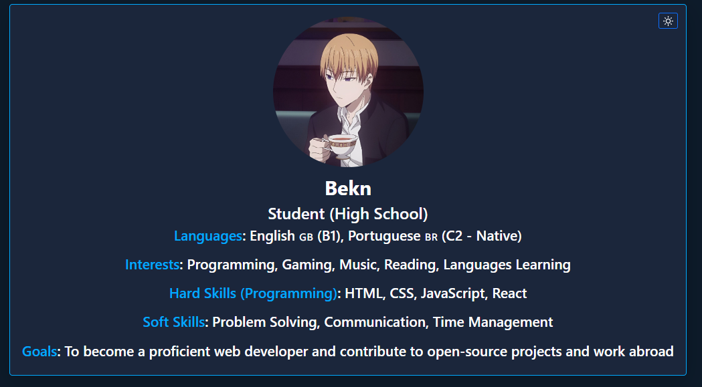

# Bekn Profile Card

A simple React + Bootstrap project that displays a personal profile card with a **dark/light theme toggle**.  
Built as a learning project to practice React state management, CSS variables, and Bootstrap utilities.

---

## ✨ Features
- Profile card with image, name, and details
- Toggle between **light mode** (white background, black text) and **dark mode** (deep navy background, white text)
- Smooth transition between themes
- Responsive layout with Bootstrap utilities
- Theme toggle button pinned to the **top‑right corner** of the screen

---

## 🌐 Deployment
This project is deployed with Vercel.

Live link: [https://mybiobekn.vercel.app](https://mybiobekn.vercel.app)

---

## 📸 Preview (Desktop)

### Light Mode


### Dark Mode



## 🚀 Getting Started

### Prerequisites
- Node.js (>= 16)
- npm or yarn

### Installation
```bash
# Clone the repository
git clone https://github.com/your-username/mynewbiobekn.git

# Navigate into the project
cd mynewbiobekn

# Install dependencies
npm install
```

### Run the app locally
```bash
npm run dev
```

Open `http://localhost:5173` in your browser.

---

## 🛠️ Tech Stack
- React (functional components + hooks)
- Bootstrap (layout and styling)
- CSS Variables for theme customization

---

## 🎨 Theme System
Defined in `index.css`:

- **Light Mode**
  - Background: `#f8f9fa`
  - Text: `#212529`
  - Card: `#ffffff`

- **Dark Mode**
  - Background: `#0d1b2a` (deep navy)
  - Text: `#ffffff` (pure white)
  - Card: `#1b263b` (lighter navy)
  - Accent: `#00aaff` (cyan glow)

---

## 📂 Project Structure
```
src/
├── App.jsx        # Main component with theme toggle
├── assets/
│   └── profile-pic.png
├── index.css      # Theme variables and styles
└── main.jsx       # React entry point
```

---

## 📜 License
This project is open source and available under the MIT License.


